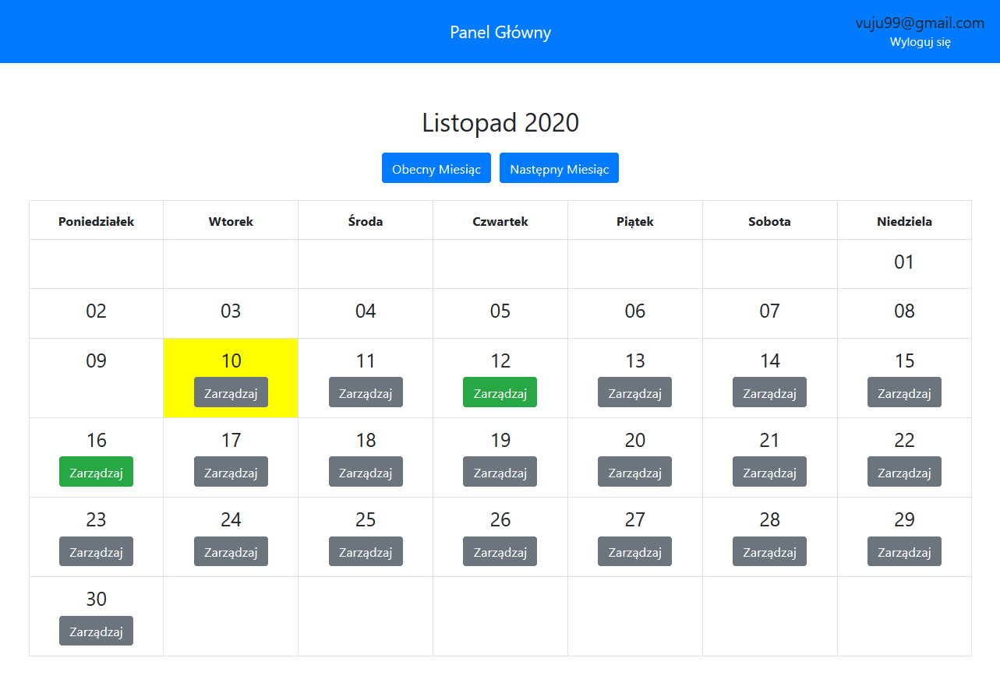
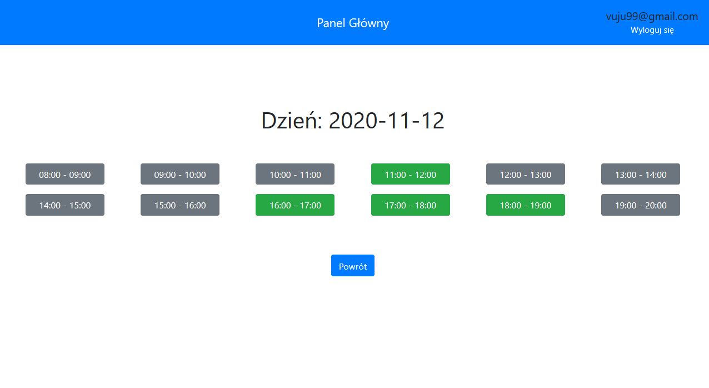
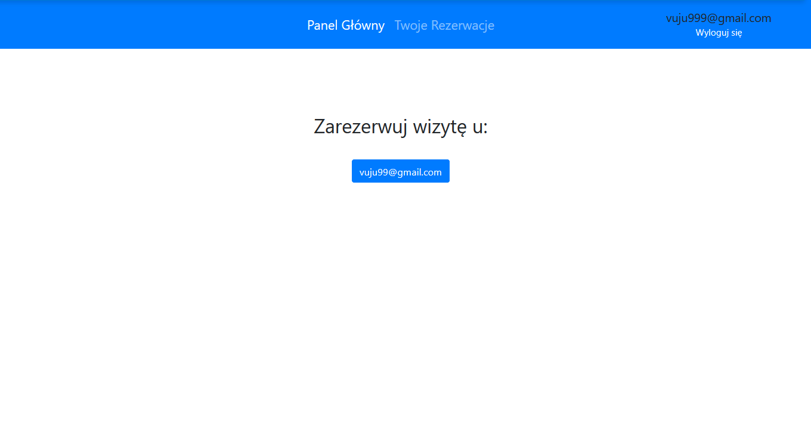
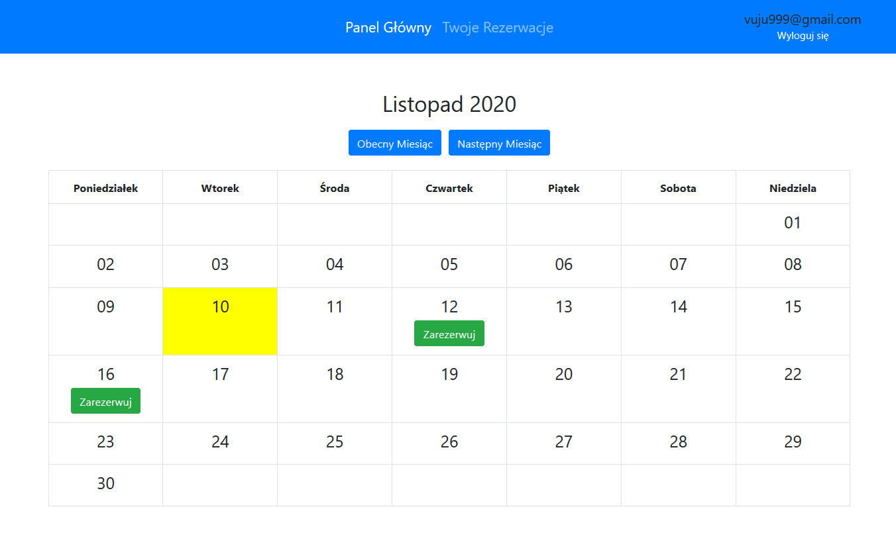
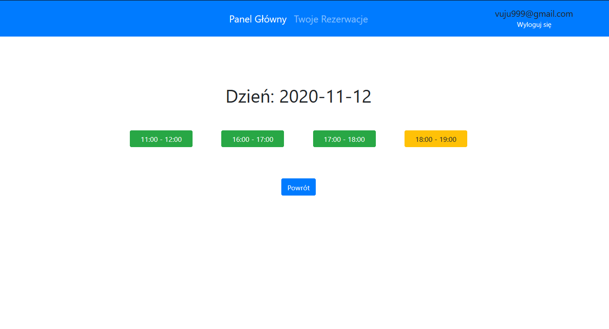

# appointment-scheduler

A symfony-based application providing a reservation system with admin and user panels.

Currently, the functionalities are:
- admins can manage their availability in 1h timeslots(the duration of timeslots is easily changeable in code, soon i will add the functionality for admins to choose what the duration of their timeslots sould be)
- users can open chosen admin's availability calendars and make bookings for the available timeslots
- users can view and manage their appointments

Functionalities soon to be added:
- when making a booking, a modal box will open where the user will be able able to give a short description regarding the appointment
- a page where admin can view and manage their appointments

The admin's calendar panel where they can manage their availability.

The user's panel where they can book their appointments within the chosen admin's availability.

